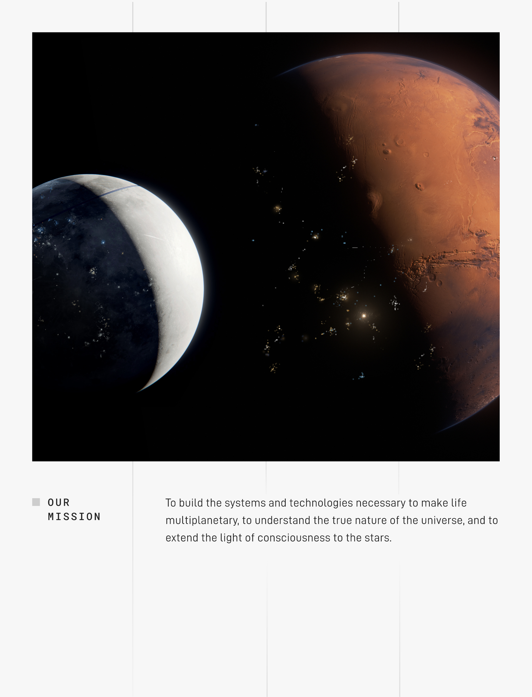
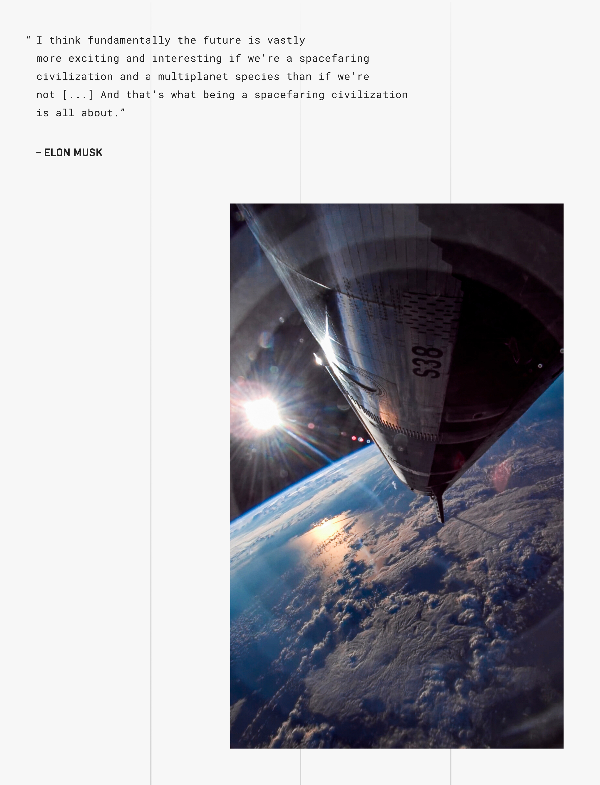

# SpaceX S-1 招股书 · 中文版

> **"建造让生命跨越星球所需的系统与技术，理解宇宙的本质，把意识的光芒延伸到群星之间。"**
> — SpaceX 使命宣言

---

## 为什么做这件事

2026 年 5 月 20 日，Space Exploration Technologies Corp. 向美国证券交易委员会（SEC）提交了 Form S-1，正式启动 IPO。

这是一份 405 页的招股书，原文是英文，专业术语密集。我把它做成了中文版，是因为我相信——**这可能是这个时代里最有使命感的一家公司，和最有使命感的一位创始人。**

它要做的不是赚钱，是把人类带去火星。

它做这件事的方式不是 PPT，是一年发射 164 次、把 9,600+ 颗卫星送上轨道、给 164 个国家提供互联网、让 1030 万人用上 Starlink。

这份招股书第一次完整披露了它在做什么、怎么做的、花了多少钱、未来想去哪里。值得每一个对未来抱有期待的人读一读。

---

## 下载

| 版本 | 大小 | 说明 |
|------|------|------|
| 📄 [**中文版 PDF**](SpaceX-S1-Prospectus-ZH.pdf) | 18 MB | 全文中文翻译（机器翻译，仅作辅助理解） |
| 📄 [**英文原版 PDF**](SpaceX-S1-Prospectus-EN.pdf) | 60 MB | 从 SEC HTML 渲染，排版与官方一致 |
| 🔗 [SEC 官方原文](https://www.sec.gov/Archives/edgar/data/1181412/000162828026036936/spaceexplorationtechnologi.htm) | — | HTML 原始版本 |

> ⚠️ **重要声明**：中文版仅用于学习和理解。投资决策、法律和会计判断请以英文原版及 SEC 官方文件为准。

---

## SpaceX 的使命

> *To build the systems and technologies necessary to make life multiplanetary, to understand the true nature of the universe, and to extend the light of consciousness to the stars.*
>
> 建造让生命跨越星球所需的系统与技术，理解宇宙的本质，把意识的光芒延伸到群星之间。

---

## 创始人怎么说

> *"I think fundamentally the future is vastly more exciting and interesting if we're a spacefaring civilization and a multiplanet species than if we're not [...] And that's what being a spacefaring civilization is all about."*
> — Elon Musk
>
> 我认为，如果我们成为一个航天文明、一个多行星物种，未来将远比现在更令人激动、更有意思；如果不是，未来就乏味得多。这就是"成为航天文明"的全部意义。

---

## 一些数字（招股书披露）

- **9,600+** 颗运行中的 Starlink 卫星
- **~75%** 占全球所有在轨可机动卫星的份额
- **~10.3M** Starlink 全球用户
- **164** 个国家覆盖
- **2025 年发射 164 次**，占全球轨道发射的多数
- 已运营的火箭家族：**Falcon 9 / Falcon Heavy / Starship**
- 已运营的航天器家族：**Dragon / Starship**
- 已部署的产品：**Starlink（消费、企业、移动、政府）**、**Starshield（国防）**

---

## 关于这个翻译

这份招股书原本只有英文 HTML 版本（SEC 官方未提供 PDF）。我做了两件事：

1. **把 SEC HTML 还原成排版完美的 PDF**：每一页都是 1:1 的 612pt × 792pt（Letter 尺寸），与原始设计一致。
2. **整本翻译成中文**。

翻译质量足够辅助理解，但**不是法律文件**——任何具体表述请以 SEC 上的官方英文原文为准。

---

## 致中文读者

如果你和我一样，相信：

- 技术不仅仅是工具，是延伸人类边界的方式；
- 真正的长期主义不是十年规划，是几代人才能完成的事；
- 火星不是科幻设定，是一个值得用工程方法解决的问题——

那么这份招股书，欢迎你读一读。

🚀

---

## License

- 招股书原文版权归 **Space Exploration Technologies Corp.** 所有，作为 SEC 公开备案文件可供公众访问。
- 本仓库的翻译工作纯粹为方便中文读者学习，**不代表任何投资建议**。
- 图片素材来源于招股书原文。
